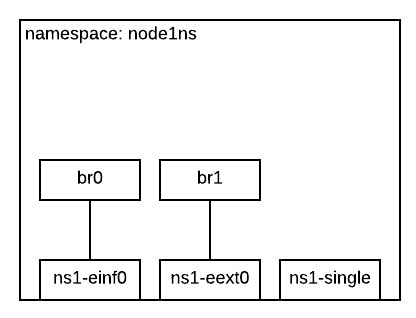
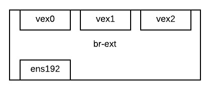
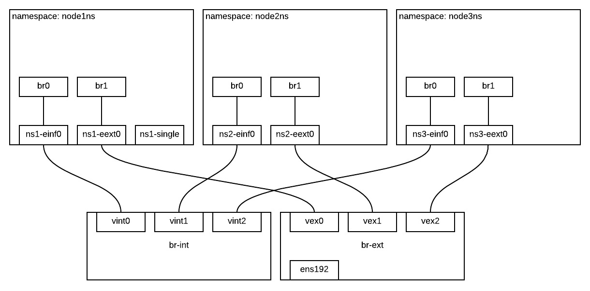

# InfraSIM Virtual Network
A tool to setup two-layer vswitches and network namespaces.

## Setup environment

Install PIP:

    sudo apt-get install python-pip

Install openvswitch:

    sudo apt-get install openvswitch-switch

Install module dependencies:

    sudo pip install -r requirements.txt

## Usage

### Run in command line
Clear any previous environment by:

    sudo python recreator.py delete

Write your `config.yml` and create the new topology:

    sudo python recreator.py create

### Leverage ivn library in your python code
Import code repo path to your environment variable:

    export PYTHONPATH=$PYTHONPATH:$(pwd)

In your code:

    from inv.core import Topology
    config_file_path = "/path/to/your/config"
    topo = Topology(config_file_path)
    topo.create() # Create new topology
    topo.delete() # Delete existing topology

## Terminology

### namespace
This is specially about network namespace. Every namespace 
is a separate network environment. Which means, you can 
setup two namespace and run infrasim-compute inside, both 
vBMC of them are listening on port 623, and they both work. 

The namespace in config are interested in two groups of 
definitions:

- `interfaces`, interfaces are the route through which inside 
namespace talk with outside. Interface name should be **UNIQUE** 
in our implementation. After infrasim virtual network created, 
you would see your definition in the file 
`/etc/netns/<namespace>/network/interfaces`.

- `bridges`, similar to interfaces but it is inside namespace so 
we allow a bridge br0 in namespace A and B at the same time. 
You can specify `bridge_ports` to bind bridge to one interface, 
which make it possibly links outside. Or you don't specify 
`bridge_ports` which leaves the bridge for namespace-inside usage. 

### ovs
Define openvswitch in host environment. It connects physical 
interfaces, virtual interfaces in namespaces and other openvswitches. 
Hope you have fun building your own lab!

The openvswitch in config are interested in the `ports` it manages 
and attributes of itself:

- `ports`, ports name should be **UNIQUE** in the whole virtual 
network. Ports are the entities to make connections.

- attributes of openvswitch itself will be recorded in 
`/etc/network/interfaces.d/<ovs>`, so that to be persist after host 
environment reset.

### connection
Define connection **FROM** network `interfaces` **TO** openvswitch 
`ports`.
`PATCH port` between two `ports` is currently **NOT** supported.

### example
With the `config.json` in our repo, you would build a virtual 
network like this:

Be careful `ens192` is not necessarily in your environment, choose 
any physical interface or just remove it in the configuration.

## Reference
If you want to do some mannual work on openvswitch and namespace, 
here's some command you can refer to.

- create openvswitch `br-int`

    sudo ovs-vsctl add-br br-int

- list openvswitch

    sudo ovs-vsctl show

- create port `veth0` on `br-int`

    sudo ovs-vsctl add-port br-int veth0

- list ports on openvswitch `br-int`

    sudo ovs-vsctl list-ports br-int

- create namespace `node0`

    sudo ip netns add node0

- create virtual interface `einf0`, and connect it to 
port `veth0`

    sudo ip link add einf0 type veth peer name veth0

- make `einf0` inside namespace `node0`

    sudo ip link set einf0 netns node0

- execute command inside namespace `node0`

    sudo ip netns exec node0 <command>

- up interface `einf0`, inside `node0`

    sudo ip netns exec node0 ip link set dev einf0 up

- get dhcp for `einf0`, if you have DHCP on this network 
path

    sudo ip netns exec node0 dhclient einf0

